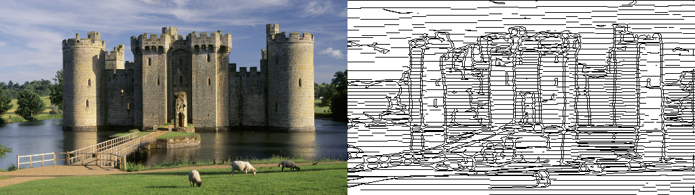
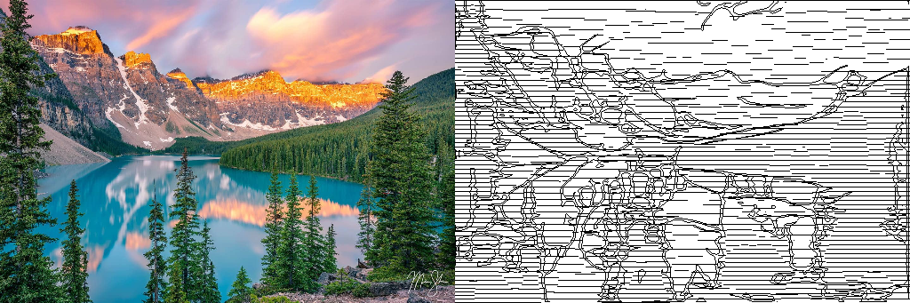
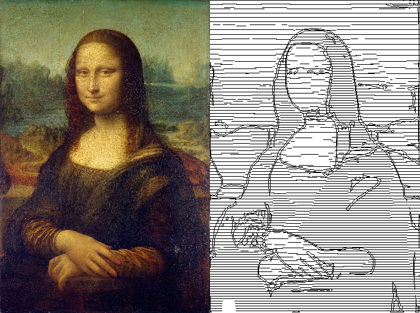

# Raster2Vector

## Intro
Repository contains all files required to apply robust transformation. It uses DexiNed23 as edge detector and SLIC algorithm to detect clusters of similar pixels.

## Examples






## Installation
To run the program Python3.8 required. Other packages can be installed using
```
pip3 install -r requirements.txt
```
